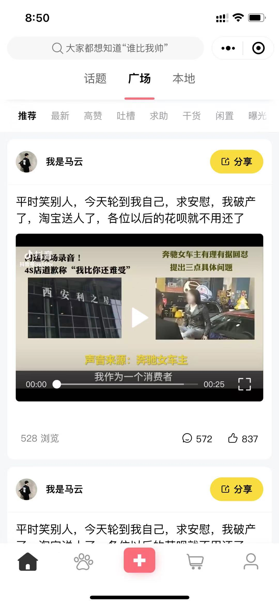
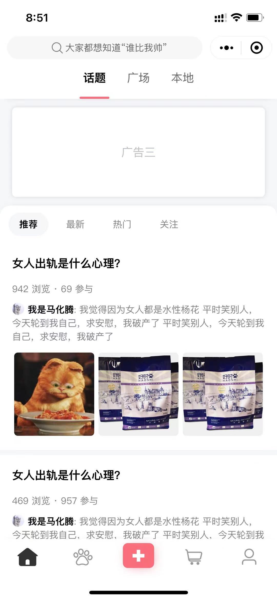
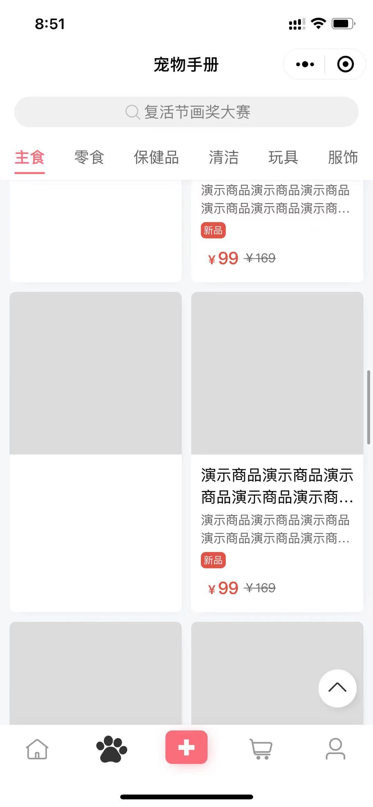
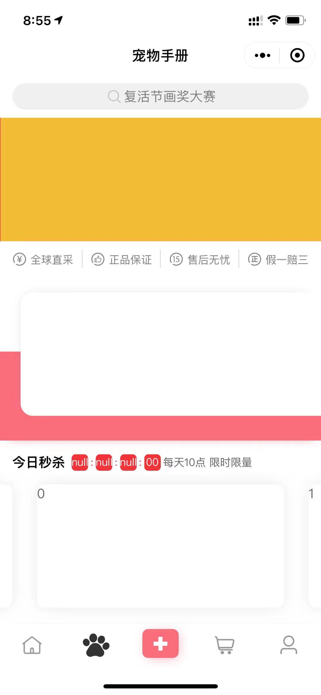
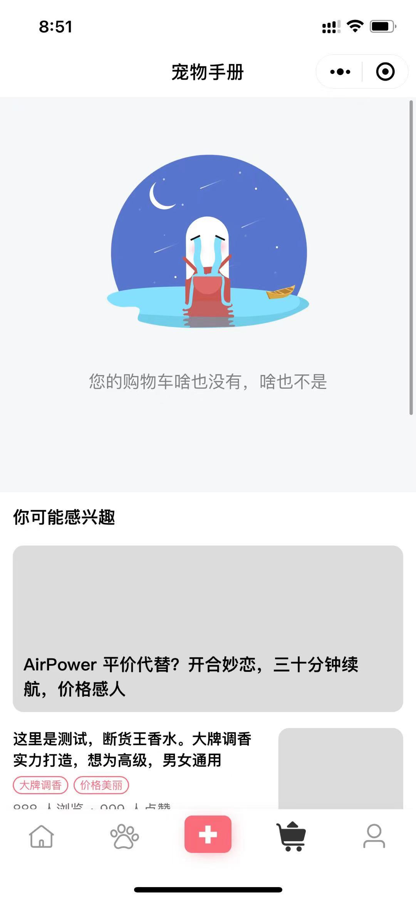
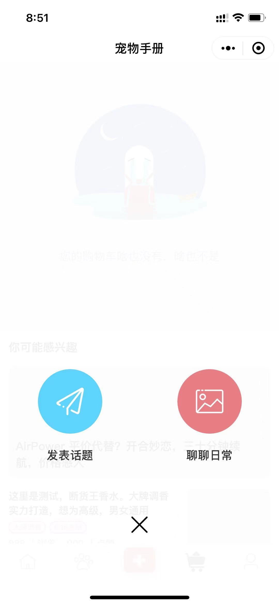
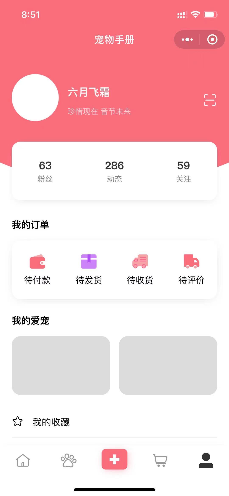
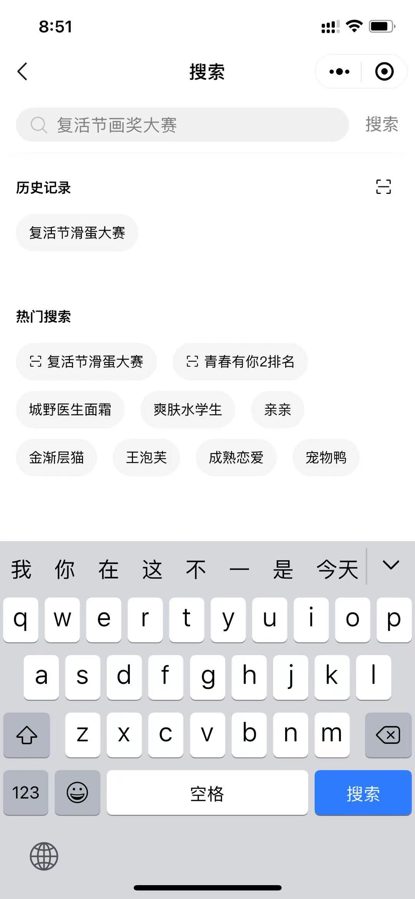

# 宠吉吉 - 宠物社区综合类微信小程序
## 项目说明
微信小程序：一个宠物社区的综合类小程序界面设计，包含了广场、话题、商城、会员四个模块。
## 目录结构
- images/github 展示图片
- pages/social 广场和话题页
- pages/shop 商城页
- pages/user 会员页
## 项目截图

## How to start

2. 使用**微信开发者工具**导入项目，选择当前项目根目录，选择打开，绑定**appid**打开
